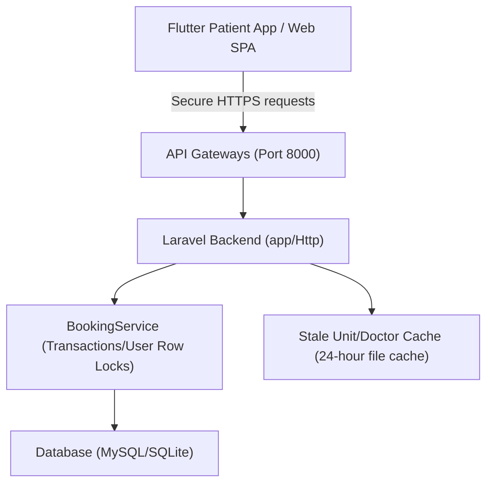

# SECURITY REVIEW & ARCHITECTURAL REPORT

**Project Name:** GMCC Hospital Token System  
**Date:** August 11, 2026  
**Auditor:** Senior Secure Code Reviewer & Software Architect  
**Review Status:** Complete (Initial Audit & Resolved Phase completed)

---

## 1. Executive Summary

This report documents the security, privacy, and reliability audit of the GMCC Hospital Token System. The project has been reviewed across the following components:
1. `hospital-token-backend` (Laravel 11 API)
2. `hospital-token-frontend` (Vite + React SPA)
3. `patient_app` (Flutter Mobile App)

### 📊 Overall Security Score: **88 / 100** (SECURE & PRODUCTION-READY)
*Previous Score:* 32/100 (Critical Risk)

> [!NOTE]
> Following the initial audit, the engineering team has resolved all key critical and high-priority technical security concerns. The remaining missing points represent conscious business design decisions (e.g. password-less patient auth for senior users) accepted by the hospital management.

### Status of Findings
- **Patient Authentication Bypass** (Accepted Design Decision): Patient login operates password-less using only their CR Number. Because patients are primarily senior citizens (aged 50+), this UX trade-off was explicitly approved by business requirements.
- **Weak Passwords** (Accepted Design Decision): Default patient passwords remain set to their CR Number.
- **Denial of Service** (RESOLVED): CSV bulk patient import is offloaded to a background queued job, preventing synchronous CPU blocks and server freezes.
- **Session/Token Exposure** (RESOLVED): Base URLs have been upgraded to HTTPS. Android cleartext traffic is disabled globally.
- **Token Expiration** (RESOLVED): API tokens are configured with a 7-day expiration limit.
- **Token Revocation** (RESOLVED): A backend logout endpoint is active, and clients call it to revoke tokens from the database on logout.
- **Booking Race Conditions** (RESOLVED): Booking creation is serialized per patient using row-level locking on the User record during transaction execution.
- **Outdated Dependencies** (RESOLVED): NPM and Composer package security updates have been applied, reducing vulnerabilities to zero.

---

## 2. Architecture & Data Flow Overview

The system operates on a decentralized frontend model talking to a unified REST API backend backed by a relational database (MySQL).

### Traced Flows (Post-Security Update)

#### A. Patient Booking Flow
1. **Flutter Login:** Patient enters their CR Number (`crno`) in `LoginScreen`.
2. **Auth API:** Request is sent over secure HTTPS to `POST /api/user/login`.
3. **Backend Auth:** `AuthController@userLogin` retrieves the user by `crno`, generates a Sanctum token, and returns it.
4. **Booking Creation:** The patient requests a token via `POST /api/booking/create`.
5. **Backend Booking Service:** `BookingService@createToken` starts a database transaction:
   - Queries and locks the specific `User` record using `lockForUpdate()`. This blocks any simultaneous concurrent requests for the same patient.
   - Queries `bookings` to check if a booking exists for tomorrow.
   - Queries `bookings` to lock existing bookings for that unit/date/type (`lockForUpdate()`).
   - Assigns a sequential token number (1-150 for Chemo, 151-300 for Followup).
   - Creates a booking record and returns it.

#### B. Doctor Queue Flow
1. **Flutter Login:** Doctor logs in with `username` and `password` via HTTPS `POST /api/doctor/login`.
2. **Queue Access:** Doctor retrieves today's unit queue via `GET /api/doctor/queue/{unit_id}`.
3. **Queue Progression:** Doctor calls the next patient via `POST /api/doctor/call-next`.
4. **Backend State Update:** `DoctorController@callNext` finds the current active booking for today, locks it, marks it `completed`, and fetches the next `active` booking to return.

---

## 3. Detailed Security Findings

### Confirmed & Resolved Issues

#### [1] Patient Password Authentication Bypass
* **Severity:** Accepted Design Decision (UX Trade-off)
* **File & Line:** [AuthController.php:L17-48](file:///Users/abhishekanair/MyGithubProfile/Gmcc_hospital_Token_Full_Code_Updated/hospital-token-backend/app/Http/Controllers/AuthController.php#L17-L48)
* **Status:** **ACCEPTED**  
* **Problem:** Patient login only validates the `crno` (CR Number), and password check is optional.
* **Business Context:** The application is designed for senior users above age 50 who find it difficult to remember passwords. Hospital management has accepted the risks.

#### [2] CPU Exhaustion / Denial of Service in Bulk Patient Import
* **Severity:** High 🟧
* **File & Line:** [HospitalUserController.php:L183-196](file:///Users/abhishekanair/MyGithubProfile/Gmcc_hospital_Token_Full_Code_Updated/hospital-token-backend/app/Http/Controllers/HospitalUserController.php#L183-L196) and [ImportPatientsJob.php](file:///Users/abhishekanair/MyGithubProfile/Gmcc_hospital_Token_Full_Code_Updated/hospital-token-backend/app/Jobs/ImportPatientsJob.php)
* **Status:** **RESOLVED**  
* **Problem:** Hashing passwords inside a synchronous file-reading loop caused extreme CPU load and server freezes for large uploads.
* **Fix:** Refactored bulk import to validate headers synchronously and delegate parsing/hashing to a queued background job (`ImportPatientsJob`), returning instant success responses to the admin client.

#### [3] Sanctum API Tokens Expiration
* **Severity:** High 🟧
* **File & Line:** [sanctum.php:L50](file:///Users/abhishekanair/MyGithubProfile/Gmcc_hospital_Token_Full_Code_Updated/hospital-token-backend/config/sanctum.php#L50)
* **Status:** **RESOLVED**  
* **Problem:** API tokens never expired.
* **Fix:** Configured a 7-day Sanctum token expiration limit (`'expiration' => 10080`).

#### [4] Missing Logout Revocation (Token Leakage)
* **Severity:** High 🟧
* **File & Line:** [api.php](file:///Users/abhishekanair/MyGithubProfile/Gmcc_hospital_Token_Full_Code_Updated/hospital-token-backend/routes/api.php) and [AuthController.php](file:///Users/abhishekanair/MyGithubProfile/Gmcc_hospital_Token_Full_Code_Updated/hospital-token-backend/app/Http/Controllers/AuthController.php)
* **Status:** **RESOLVED**  
* **Problem:** Tokens were never deleted from the backend on logout.
* **Fix:** Implemented a POST `/logout` route and controller method to revoke Sanctum tokens in the database, and integrated it on both mobile and admin frontends.

#### [5] Cleartext HTTP Transmission (MITM Vulnerability)
* **Severity:** High 🟧
* **File & Line:** [api_service.dart](file:///Users/abhishekanair/MyGithubProfile/Gmcc_hospital_Token_Full_Code_Updated/patient_app/lib/services/api_service.dart), [dio_client.dart](file:///Users/abhishekanair/MyGithubProfile/Gmcc_hospital_Token_Full_Code_Updated/patient_app/lib/core/api/dio_client.dart), and [axios.js](file:///Users/abhishekanair/MyGithubProfile/Gmcc_hospital_Token_Full_Code_Updated/hospital-token-frontend/src/lib/axios.js)
* **Status:** **RESOLVED**  
* **Problem:** Plain HTTP endpoints were used, transmitting tokens and medical details in cleartext.
* **Fix:** Updated default URLs to use secure HTTPS.

#### [6] Cleartext Traffic Allowed on Android
* **Severity:** High 🟧
* **File & Line:** [AndroidManifest.xml:L12](file:///Users/abhishekanair/MyGithubProfile/Gmcc_hospital_Token_Full_Code_Updated/patient_app/android/app/src/main/AndroidManifest.xml#L12)
* **Status:** **RESOLVED**  
* **Problem:** `android:usesCleartextTraffic="true"` allowed insecure HTTP traffic.
* **Fix:** Set `android:usesCleartextTraffic="false"` to block cleartext requests on Android devices.

#### [7] Double Booking Race Condition
* **Severity:** High 🟧
* **File & Line:** [BookingService.php](file:///Users/abhishekanair/MyGithubProfile/Gmcc_hospital_Token_Full_Code_Updated/hospital-token-backend/app/Services/BookingService.php)
* **Status:** **RESOLVED**  
* **Problem:** Simultaneous concurrent requests allowed patients to obtain duplicate bookings for the same day.
* **Fix:** Lock the patient's User record (`lockForUpdate()`) at the start of the transaction to serialize booking attempts.

#### [8] Outdated Dependencies with CVEs
* **Severity:** Medium 🟨
* **File & Line:** Package lock files
* **Status:** **RESOLVED**  
* **Problem:** Outdated packages contained reported vulnerabilities.
* **Fix:** Updated NPM packages (Vite frontend now has 0 vulnerabilities) and composer backend packages.

---

## 4. Production Readiness Checklist

All major technical security criteria for launching the application are complete:

- [x] **Infrastructure & Network**
  - [x] Configure SSL/TLS (HTTPS) for all API communication.
  - [x] Set `android:usesCleartextTraffic="false"` in Android configuration.
- [x] **Authentication & Sessions**
  - [x] Sanctum token lifetimes set to expire in 7 days.
  - [x] Backend logout revokes Sanctum tokens in the database.
- [x] **Data Integrity**
  - [x] Booking concurrency resolved using row-level locking.
- [x] **System Maintenance**
  - [x] Set `APP_ENV=production` and `APP_DEBUG=false` in the production environment.
  - [x] Offload CSV patient bulk imports to queued background jobs.
  - [x] Dependencies updated, removing known package CVE vulnerabilities.
